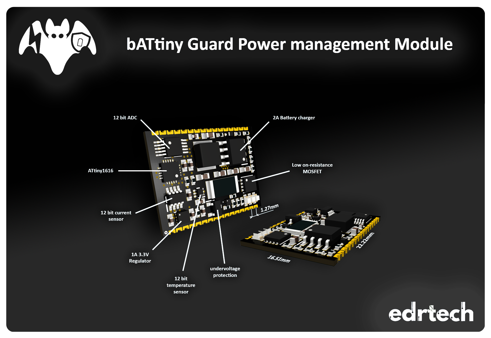

---------------------------------------------------------------------------------
> [!NOTE]
> "bATtiny Guard" and "PMG001" may be used interchangeably elsewhere in the documentation.

---------------------------------------------------------------------------------
# bATtiny Guard Power management module

bATtiny Guard is a highly integrated module designed for efficient management of single-cell
Li-Po battery systems. It incorporates various essential ICs to address all aspects of power
management, including battery charging, switch/button power on/off behavior, undervoltage
and overvoltage protection, flexible voltage measurement, battery current measurement, and
temperature monitoring. Additionally, it features a microcontroller for programming custom
behaviors, ensuring comprehensive management of single-cell rechargeable battery
systems.
Furthermore, when paired with the demo kit base PCB, the module serves as a general
development board for the ATTINY1616, with all
18 GPIO pins accessible for any application.
&nbsp;
&nbsp;
&nbsp;
&nbsp;
&nbsp;
&nbsp;
&nbsp;
&nbsp;
&nbsp;
&nbsp;

# Features
&nbsp;
&nbsp;
&nbsp;

&nbsp;
&nbsp;
&nbsp;
&nbsp;
&nbsp;

- 32 PIN 22.22mm *16.51mm package
- On/off behavior control
- 2A single cell charger
- Single li-po cell powered
- 4+16 ADC channels
- Battery current measurement
- Brown-out detection/reset circuit
- Low on-resistance battery output MOSFET
- On-module temperature measurement
- I2C Interface
- Arduino compatible

 

---------------------------------------------------------------------------------

  
  
  
  

---------------------------------------------------------------------------------

  
  

---------------------------------------------------------------------------------

# Installation and set up

To program this module you will need the following:

- Arduino IDE (Or other IDE of your choosing)
- [megaTinyCore](https://github.com/SpenceKonde/megaTinyCore)
- Demo kit with the module soldered on

&nbsp;
&nbsp;
&nbsp;
&nbsp;

Demo board and cover board views.

</img>

&nbsp;
&nbsp;
&nbsp;
&nbsp;
&nbsp;
&nbsp;
&nbsp;
&nbsp;

There's no need to install any additional libraries as the example code only uses the wire library to handle I2C, the rest is in the [example](bATtiny_guard_default_code/bATtiny_guard_default_code.ino) code. Keep in mind that some register values are hardcoded, which is not the best way to handle something like that but is done here for the sake of simplicity. You can use external libraries with this module without issues, you just need to redefine I2C adresses of devices as they don't necessarily match with other libraries.

&nbsp;
&nbsp;
&nbsp;
&nbsp;

Board settings should be set up like this:

</img>

Default code provides basic power management and monitoring - press PWR_SW for >500ms and BAT_OUT will turn on, hold PWR_SW for >3s and BAT_OUT will turn off.

To start, you should have the demo board connected via USB to your computer. Powering over USB only will work most of the time, but it is strongly recommended to have the battery connected to the demo board/module.
Switching between USB modes is done with the use of a tactile switch on the demo board; for flashing/programming, set it to 'UPDI', by pressing the button again, the mode is toggled to 'Serial' which will allow for serial communication.

</img>
&nbsp;
&nbsp;
&nbsp;
&nbsp;

</img>

&nbsp;
&nbsp;
&nbsp;
&nbsp;
&nbsp;
&nbsp;
&nbsp;
&nbsp;

Example output to serial (ADC pins floating):

</img>

For more information, please read the [datasheet](bATtiny_guard_datasheet.pdf).

---------------------------------------------------------------------------------
    
# Module Schematic

---------------------------------------------------------------------------------

# Demo board Schematic

---------------------------------------------------------------------------------
# bATtiny Series

---------------------------------------------------------------------------------
# [License](LICENSE)

  
  
  

